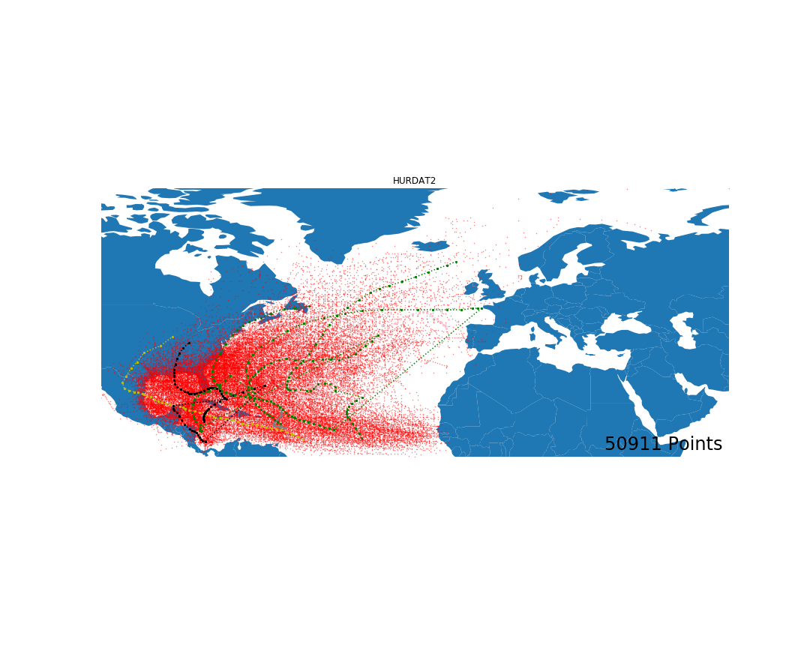

# HURDAT2_processor
# Best Track Data (HURDAT2)

Atlantic hurricane database (HURDAT2) 1851-2018 (5.9MB download)
This dataset was provided on 10 May 2019 to include the 2018 update to the best tracks.

This dataset (known as Atlantic HURDAT2) has a comma-delimited, text format with six-hourly information on the location, maximum winds, central pressure, and (beginning in 2004) size of all known tropical cyclones and subtropical cyclones. The original HURDAT database has been retired.

Detailed information regarding the Atlantic Hurricane Database Re-analysis Project is available from the Hurricane Research Division.

ref:https://www.nhc.noaa.gov/data/

#https://www.nhc.noaa.gov/data/hurdat/hurdat2-format-atlantic.pdf
# HURDAT2 Processor

This is a python script that convert your HURDAT to a dataframe and generate a CSV file for you to eaily process this data. This work is part of trajectory segmentation research[1]. We use this dataset for evaluation purposes. If you are going to apply this script please cite to our work.
Thanks.

[1]: Etemad, M., Júnior, A. S., Hoseyni, A., Rose, J., & Matwin, S. (2019). A Trajectory Segmentation Algorithm Based on Interpolation-based Change Detection Strategies. In EDBT/ICDT Workshops.

# visualization of HURDAT2

